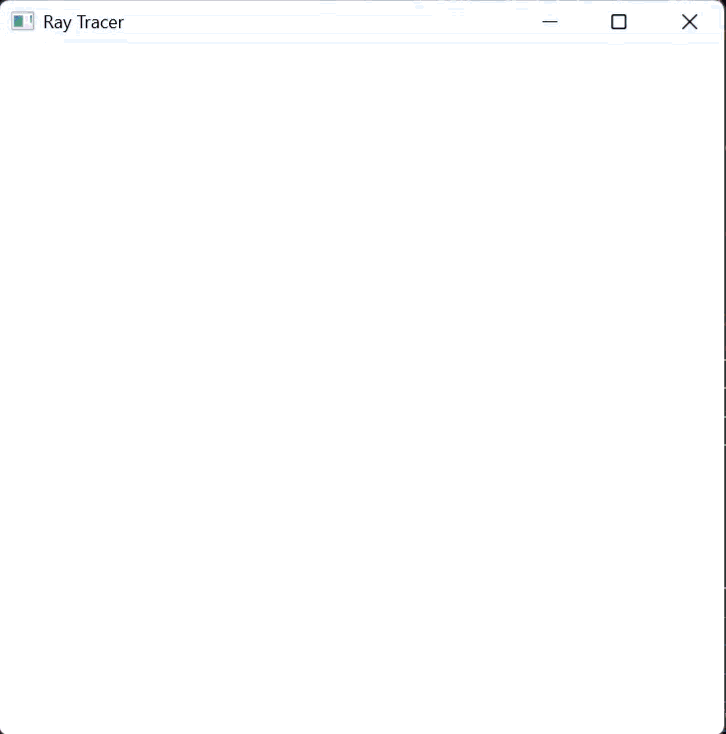

<p align="center">

</p>

# Native Win32 CPU Raytracer
## Overview
A lightweight, from-scratch CPU raytracer written in C++. It renders a 3D scene of spheres directly to a native Windows OS window. It features reflection, refraction, and a light source without relying on hardware-accelerated graphics APIs like OpenGL, Vulkan, or Direct3D.

## Technical Highlights & Architecture
* **Recursive Raytracing:** Implements a recursive `trace` function to compute multi-bounce reflections up to a configurable maximum depth.
* **Fresnel Approximation:** Calculates view-dependent reflectivity using a mathematical approximation of the Fresnel effect based on the angle of incidence.
* **Shadow Rays:** Casts secondary shadow rays towards light sources, applying occlusion multipliers to determine hard shadows from intersecting geometry.
* **Multisample Anti-Aliasing (MSAA):** Implements sub-pixel jittering to sample multiple rays per pixel for anti-aliasing.
* **Native Windows Integration:** Handles native OS message pumping and draws the computed framebuffer pixel-by-pixel directly to the device context (HDC).
* **Zero External Dependencies:** Built relying solely on the C++ Standard Library and the Windows API.

## Build Instructions (Windows / MSVC)
This project is configured as a native Visual Studio project. Because it relies exclusively on the Windows API, there are no external third-party libraries (such as GLFW or GLM) required to build it.

### Setup & Build
1. Clone the repository:
   ```bash
   git clone https://github.com/mathijs28498/Software-raytracer.git
   ```
2. Open the Visual Studio solution/project file in **Visual Studio 2022 or newer**.
3. Set the build configuration to **Release** or **Debug** and platform to **x64**. *(Note: Release mode is highly recommended, as CPU-based `SetPixel` rendering is heavily unoptimized in Debug mode).*
4. Build the solution and run.

## License
This project is licensed under the [MIT License](LICENSE).
